<p align="center">
  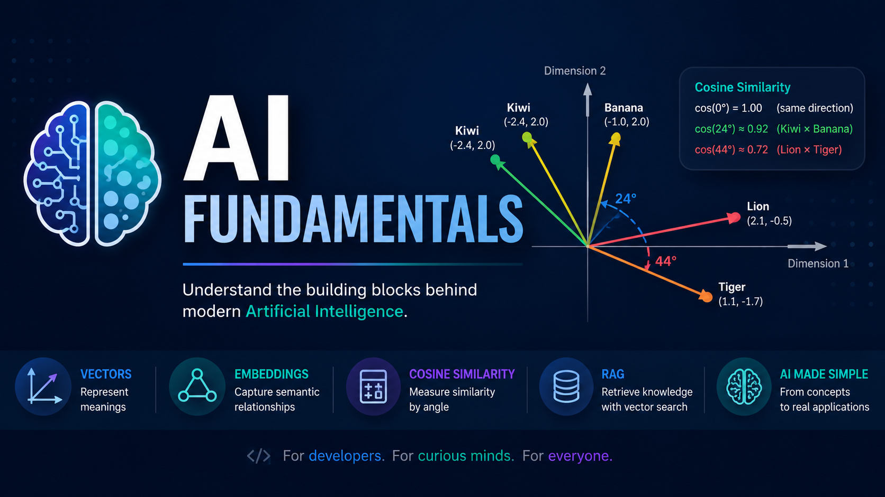
</p>

# AI Fundamentals

[](LICENSE)


[](README.pt-BR.md)
[](https://github.com/wekers/AI-Fundamentals)

A beginner-friendly guide to understanding how modern AI works through **Embeddings**, **Vectors**, and **Cosine Similarity**.

🌍 **Languages**

- 🇺🇸 [English](https://github.com/wekers/AI-Fundamentals)
- 🇧🇷 [Português](README.pt-BR.md)

---

Have you ever wondered how a computer knows that a **Lion** is more similar to a **Tiger** than to a **Banana**?

Computers don't see images or understand words — they only understand _numbers_.

This guide will take you step by step through the world of **Embeddings**, **Vectors**, and **Cosine Similarity**, using real-world examples.

---

## 📦 1. What exactly is an "Embedding"?

Imagine you are a **teacher** and need to describe animals and fruits using only _a list of numbers_.

- A **Lion** might be: `[2.1, -0.5, 7.5, 20.3, 21.0]`
- A **Tiger** might be: `[1.1, -1.7, 7.3, 20.5, 21.5]`
- A **Banana** might be: `[-1.0, 2.0, 1.2, 5.5, 2.5]`
- A **Kiwi** might be: `[-2.4, 2.0, 1.3, 5.2, 2.3]`

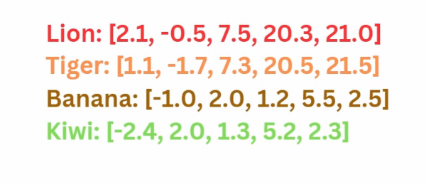

> 👀 **Look closely!** The numbers for **Lion** and **Tiger** are almost identical! Meanwhile, the numbers for **Banana** and **Kiwi** (which are `[-2.4, 2.0, 1.3, 5.2, 2.3]`) are also very similar to each other.<BR>
> 💡 This list of numbers is what we call an **Embedding**.

✨ Embeddings are **vector representations** learned by an AI model. <BR>

They work like a mathematical map that groups similar meanings together to help AI models understand context..

The model learns to place semantically similar concepts close together in a mathematical space.

### 📲 How does the model create these numbers?

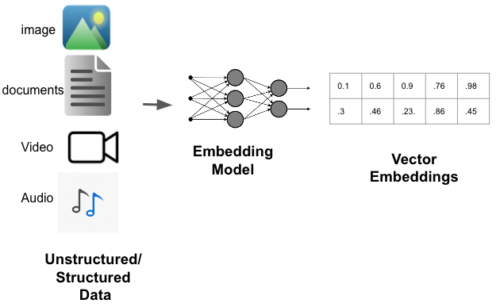

"It learns which words tend to appear in the same contexts."

**📖 During training, the model might encounter millions of sentences like these:**

The lion hunts.

The tiger hunts.

The lion is a feline.

The tiger is a feline.

The lion has a mane.

The tiger has stripes.

**✅ Because "Lion" and "Tiger" repeatedly appear in similar contexts, the model learns to represent them with vectors that are close together in the vector space.**

---

## 📍 2. Starting Simple: 1D (a line)

Let's shrink our lists to just **one number** (1 Dimension).

- Lion: `[2.1]`
- Tiger: `[1.1]`
- Banana: `[-1.0]`
- Kiwi: `[-2.4]`

If we place these on a line (the X-axis), we get:

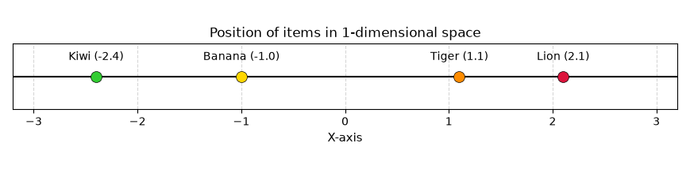

**Observation:**

- **Lion** and **Tiger** are close neighbors (2.1 and 1.1).
- **Banana** and **Kiwi** are close neighbors (-1.0 and -2.4).
- The model can already distinguish similar groups!

**Limitation**

A single dimension cannot represent many meanings.

Imagine representing a person using only:

```
Height
```

That describes almost nothing.

**We need more dimensions.**

---

## 🗺️ 3. Advancing to 2D (the Cartesian plane)

Now let's expand to **two numbers** (2 Dimensions), like map coordinates (X and Y).

- Lion: `[2.1, -0.5]`
- Tiger: `[1.1, -1.7]`
- Banana: `[-1.0, 2.0]`
- Kiwi: `[-2.4, 2.0]`

### Coordinate Map

Below is a simple chart showing where each one is located:
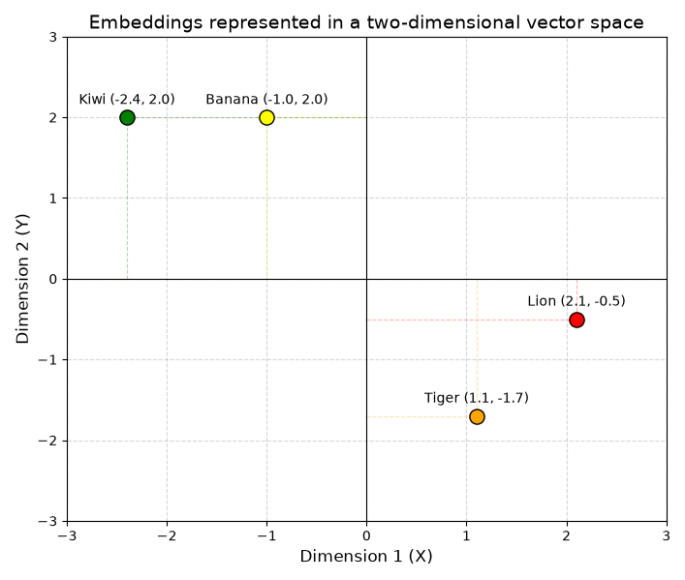

**Lion** and **Tiger** are grouped on the right. **Banana** and **Kiwi** are grouped on the left.<br>
Now the distances make much more sense.<br>
The AI has already separated the animals from the fruits!

---

## 🏹 4. The Key Idea: Vectors as Arrows

Instead of just looking at points, imagine drawing an **arrow** from the center of the chart (0,0) to each point. These arrows are the **Vectors**.

See how the arrows behave:

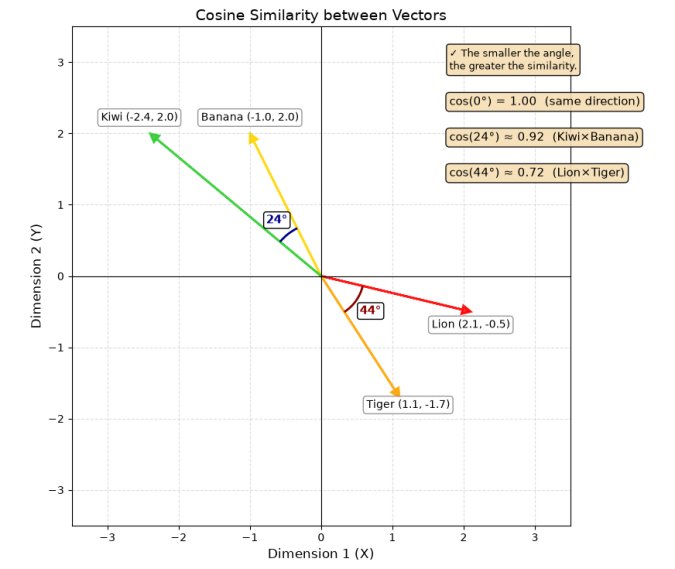

> **Notice that the length of the arrows is not the most important factor. What determines similarity is the angle between them.**

**Each arrow represents an embedding.**

The origin (0,0) is just the reference point.

- **Direction** ≈ **Meaning**. <br>
You can think of the direction as representing meaning.
- **Length** = Magnitude (we usually don't care about this for measuring similarity).

🎯 To find out if two things are similar, just measure **the angle between the arrows**.

- If the arrows point in the **same direction** (angle = 0°) → Very similar!
- If the arrows point in **opposite directions** (angle = 180°) → Completely different!
- If the arrows are **perpendicular** (angle = 90°) → Unrelated.

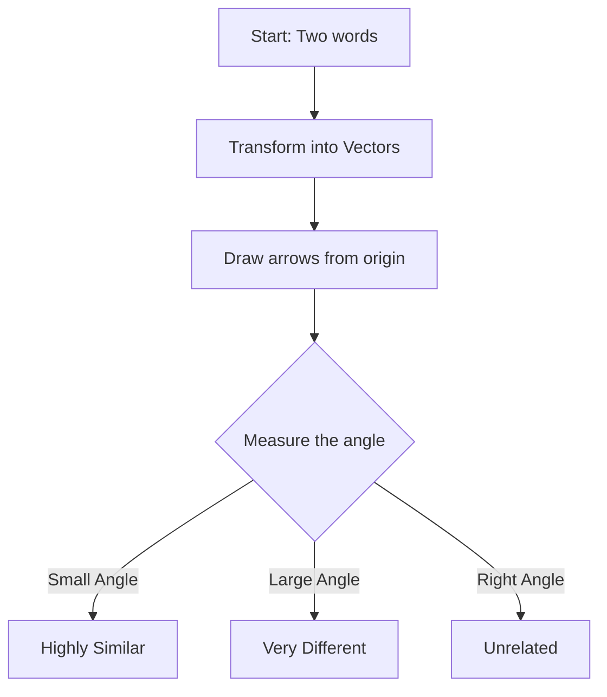

---

## 📐 5. AI Usually Uses Cosine Similarity (the math simplified)

Here is the formula:<BR>

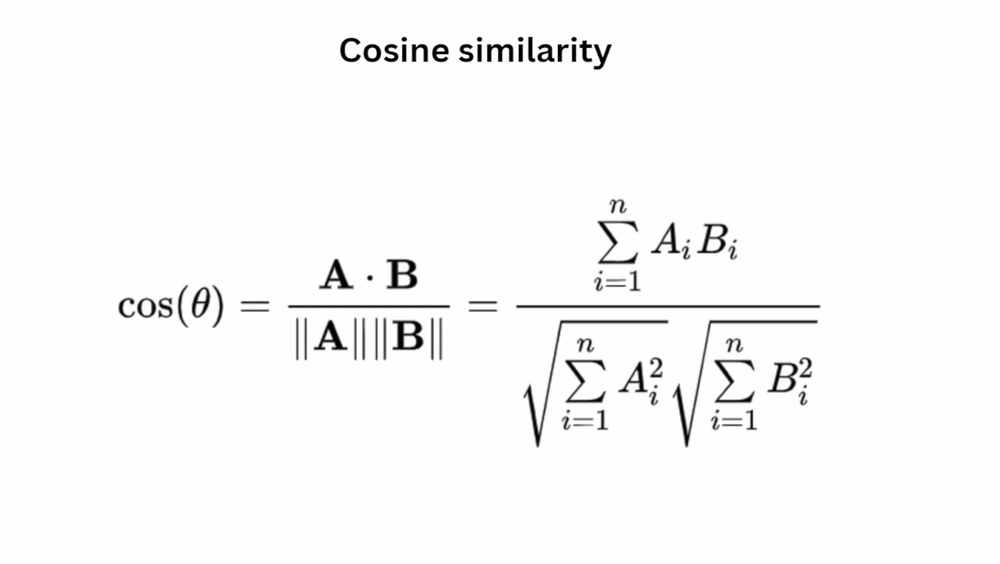

**Let's break it down:**

1. **Top part (Dot Product)**: Multiply the corresponding numbers from the two lists and add them all up. If both lists have large positive numbers (or large negative numbers) in the same positions, this number becomes huge (meaning they point in the same direction).
2. **Bottom part (Lengths)**: Calculate the length of each arrow and multiply them together. We do this to "normalize" (standardize). This way, a _very long_ arrow doesn't get more importance than a _short_ one. **We only care about direction!**
3. **The Result**: You get a number between **-1** and **1**.

| Cosine Score | Angle | Meaning                                   |
| :----------- | :---- | :---------------------------------------- |
| **1.0**      | 0°    | Identical direction (e.g., "King" and "Monarch") |
| **0.72**     | 44°   | Quite similar (e.g., **Lion** and **Tiger**) |
| **0.0**      | 90°   | Unrelated (e.g., "Cat" and "Car")          |
| **-1.0**     | 180°  | Exact opposites (e.g., "Hot" and "Cold")   |

---

## 🧮 6. Let's Apply This to the Images We've Seen!

**Example 1: Lion vs Tiger**<br>

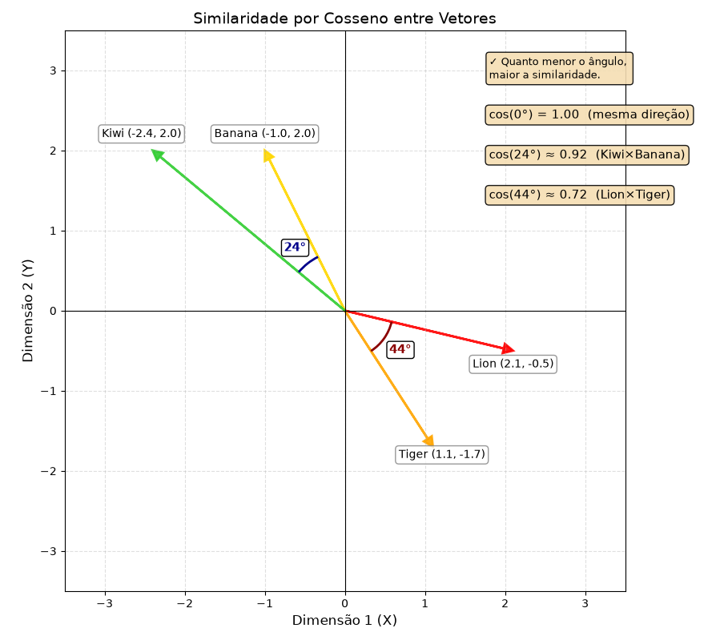

The figure shows the angle between them is **44°**.

cos(44°) ≈ **0.72**.<br>
✅ This is a high score! The AI confidently says: _"Lions and Tigers are very similar animals."_
<br><br>

**Example 2: Opposite directions**

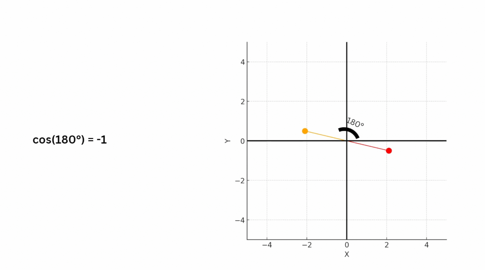 <br>
The image above shows cos(180°) = -1.<br><br>
Imagine the word **"Good"** represented by **[1, 0]** and **"Evil"** represented by **[-1, 0]**. <br>
They point in exactly opposite directions. <br>
**The model represents them as semantic opposites.**

---

## 🌌 7. But Wait, We Have 5 Dimensions! (And beyond!)

The image shows vectors with **5 numbers** (e.g., Lion: `[2.1, -0.5, 7.5, 20.3, 21.0]`). You might think: _"How do I draw an angle in 5 dimensions?!"_

You can't draw it, but mathematics doesn't care about that!<br>
Whether it's 1D, 2D, 5D, or **1,000 Dimensions** (which is what ChatGPT uses).

**We only use 2 dimensions because we can draw them. In practice, models work with hundreds or thousands of dimensions.**

Modern models use:

- 384 dimensions
- 768 dimensions
- 1024 dimensions
- 1536 dimensions
- 3072 dimensions and higher

The Cosine Similarity formula works exactly the same way.

- Step 1: Multiply the first numbers together, the second ones together... up to the fifth.
- Step 2: Sum everything.
- Step 3: Divide by the lengths.

The result is still just **one number** between -1 and 1 that tells you how similar they are.

---

## 🤖 8. How Does This Work in a ChatGPT?

### 🧠 "Pure" ChatGPT

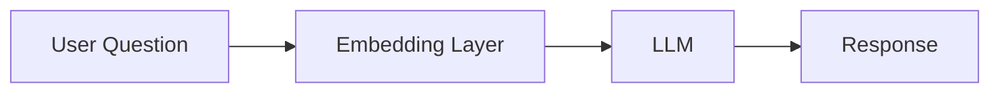

**💡When the model responds only with the knowledge acquired during training, this flow is sufficient.**

### 📚 ChatGPT with RAG (connected to documents)

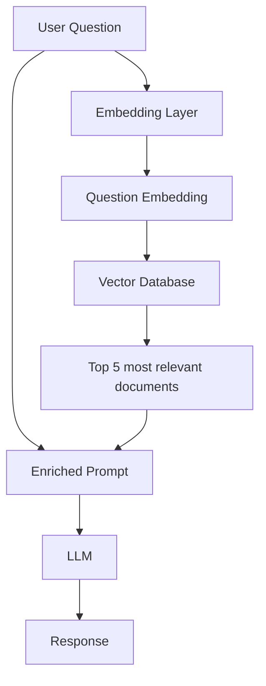

📄 **When the system has access to a document base (company, PDFs, manuals, wiki, etc.), it uses a vector database to retrieve the most relevant information before generating the response.**

> 💡 **Summary**
>
> - An LLM can respond using only the knowledge acquired during training.
> - When connected to a vector database (RAG), it can also query external documents before responding.
> - In both cases, embeddings are fundamental for representing the meaning of the question and finding semantically similar information.

---

## Key Takeaways (The 3 Golden Rules)

1. **Embeddings** are just lists of numbers that represent words/objects in a way the computer can understand.
2. **Vectors** are arrows pointing from the center to those numbers. The arrow's direction represents the _meaning_.
3. **Cosine Similarity** measures the angle between these arrows. A score close to **1** means they are highly similar; close to **-1** means they are semantically opposite.

✨ Every modern Generative AI system (ChatGPT, Gemini, Claude, Copilot), uses embeddings in some way.

---

## 🤓 Did You Know?

GPT doesn't "understand" words the same way we do.

Before generating any response, it transforms your text into vectors (embeddings), looks for mathematical patterns among them, and uses these relationships to understand the context of the conversation.

In practice, behind seemingly natural sentences, there is a lot of linear algebra working silently.

---

## 🎉 Congratulations!

If you've made it this far, you've already understood one of the most important concepts behind modern Large Language Models.

Whenever you hear about:

- ChatGPT
- Gemini
- Claude
- Copilot
- Semantic Search
- RAG
- Vector Database

remember that behind the scenes of AI, there is a process very similar to what you just studied:

Now, if the question arises **how does AI know that a Lion is similar to a Tiger**, you can answer: _"The AI transforms them into arrows, places them on a giant 5D map, and notices that they point in almost the same direction!"_ 🦁🐯

## ✅ What You Learned

After this chapter, you now know:

- ✔️ What an embedding is.
- ✔️ How a model creates embeddings.
- ✔️ What a vector is.
- ✔️ What each dimension represents.
- ✔️ How Cosine Similarity works.
- ✔️ Why similar words end up close together.
- ✔️ How this is used in modern LLMs.

✨ **If this content made sense to you, please help with just one ⭐ on the repository!**