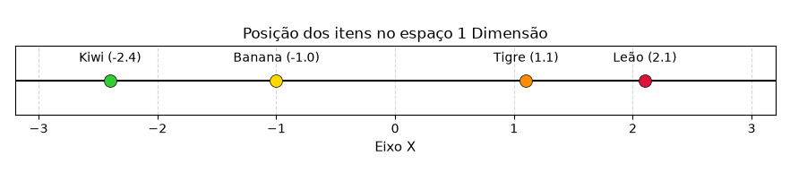
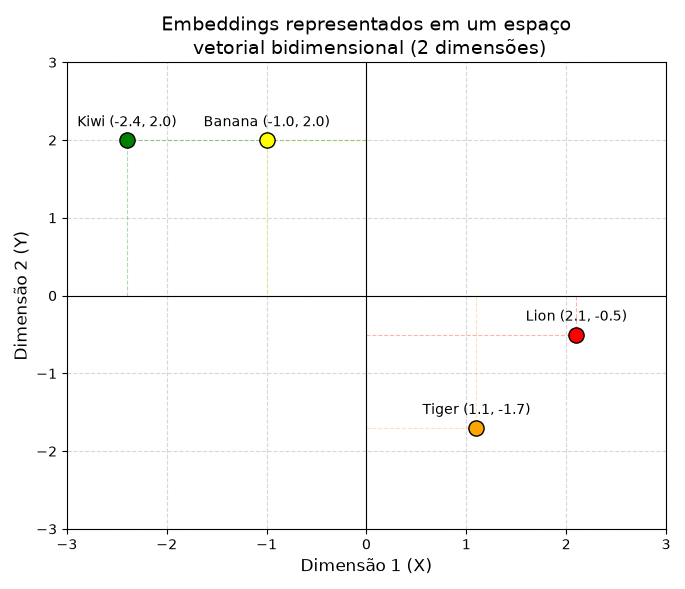
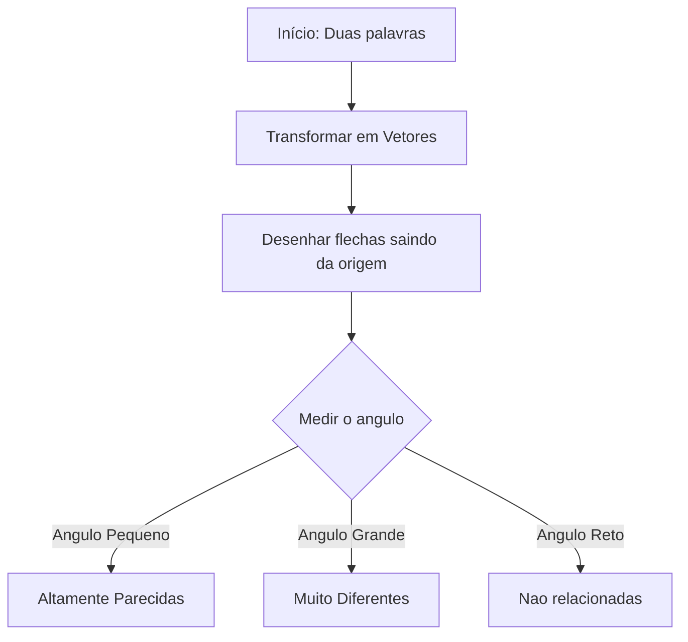
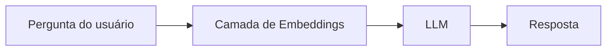
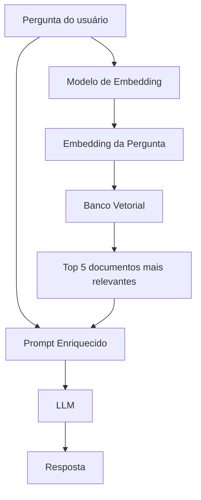

<p align="center">
  
</p>

# AI Fundamentals

[](LICENSE)


[](README.pt-BR.md)
[](https://github.com/wekers/AI-Fundamentals)

Um guia acessível sobre como a IA moderna funciona por meio de embeddings, vetores e similaridade de cosseno.

🌍 **Languages**

- 🇺🇸 [English](https://github.com/wekers/AI-Fundamentals)
- 🇧🇷 [Português](README.pt-BR.md)

---

Você já se perguntou como um computador sabe que um **Leão** é mais parecido com um **Tigre** do que com uma **Banana**?

Os computadores não enxergam imagens nem entendem palavras — eles só entendem _números_.

Este guia vai te levar passo a passo pelo mundo dos **Embeddings**, **Vetores** e **Similaridade por Cosseno**, usando os exemplos reais.

---

## 📦 1. Mas o que é esse tal de "Embedding"?

Imagine que você é um **professor** e precisa descrever animais e frutas usando apenas _uma lista de números_.

- Um **Leão** pode ser: `[2.1, -0.5, 7.5, 20.3, 21.0]`
- Um **Tigre** pode ser: `[1.1, -1.7, 7.3, 20.5, 21.5]`
- Uma **Banana** pode ser: `[-1.0, 2.0, 1.2, 5.5, 2.5]`
- Um **Kiwi** pode ser: `[-2.4, 2.0, 1.3, 5.2, 2.3]`


> 👀 **Observe com atenção!** Os números do **Leão** e do **Tigre** são quase idênticos! Já os números da **Banana** e do **Kiwi** (que são `[-2.4, 2.0, 1.3, 5.2, 2.3]`) também são bem parecidos entre si.<BR>
> 💡Essa lista de números é o que chamamos de **Embedding**

✨ Embeddings são **representações vetoriais** aprendidas por um modelo de IA. <BR>

Eles funcionam como um mapa matemático que agrupa significados semelhantes para ajudar inteligências artificiais a entender o contexto.

A IA aprende a colocar coisas semelhantes mais próximas umas das outras nesse "espaço matemático".

### 📲 Como o modelo cria esses números?


"Ele aprende quais palavras costumam aparecer
nos mesmos contextos."

**📖 Durante o treinamento, o modelo pode encontrar milhões de frases como estas:**

O leão caça.

O tigre caça.

O leão é um felino.

O tigre é um felino.

O leão tem juba.

O tigre tem listras.

**✅ Como "Leão" e "Tigre" aparecem repetidamente em contextos semelhantes, o modelo aprende a representá-los com vetores próximos no espaço vetorial.**

---

## 📍 2. Começando simples: 1D (uma reta)

Vamos encolher nossas listas para apenas **um número** (1 Dimensão).

- Leão: `[2.1]`
- Tigre: `[1.1]`
- Banana: `[-1.0]`
- Kiwi: `[-2.4]`

Se colocarmos isso numa reta (eixo X), enxergamos o seguinte:



**Observação:**

- **Leão** e **Tigre** são vizinhos próximos (2.1 e 1.1).
- **Banana** e **Kiwi** são vizinhos próximos (-1.0 e -2.4).
- A IA já consegue perceber que eles formam grupos parecidos!

**Limitação**

Uma única dimensão não consegue representar muitos significados.

Imagine representar uma pessoa usando apenas:

```
Altura
```

Isso não descreve quase nada.

**Precisamos de mais dimensões.**

---

## 🗺️ 3. Avançando para 2D (o plano cartesiano)

Agora vamos expandir para **dois números** (2 Dimensões), que nem as coordenadas de um mapa (X e Y).

- Leão: `[2.1, -0.5]`
- Tigre: `[1.1, -1.7]`
- Banana: `[-1.0, 2.0]`
- Kiwi: `[-2.4, 2.0]`

### Mapa de coordenadas

Abaixo, um gráfico simples mostrando onde cada um está:


**Leão** e **Tigre** estão agrupados à direita. **Banana** e **Kiwi** estão agrupados à esquerda.<br>
Agora as distâncias fazem muito mais sentido.<br>
A IA já separou os bichos das frutas!

---

## 🏹 4. O segredo: "Vetores" como flechas

Em vez de olhar apenas para pontos, imagine desenhar uma **flecha** saindo do centro do gráfico (0,0) até cada ponto. Essas flechas são os **Vetores**.

Veja como as flechas se comportam:


> **Observe que o comprimento das setas não é o fator mais importante. O que determina a similaridade é o ângulo entre elas.**

**Cada seta representa um embedding.**

A origem (0,0) é apenas o ponto de referência.

- **Direção** -> **Podemos pensar na direção como representando o significado.**.
- **Comprimento** = Magnitude (geralmente não nos importamos com isso para medir similaridade).

🎯 Para saber se duas coisas são parecidas, basta medir **o ângulo entre as flechas**.

- Se as flechas apontam na **mesma direção** (ângulo = 0°) → Muito parecidas!
- Se as flechas apontam em **direções opostas** (ângulo = 180°) → Totalmente diferentes!
- Se as flechas estão **perpendiculares** (ângulo = 90°) → Não têm relação.



---

## 📐 5. IA costuma usar Similaridade por Cosseno (a matemática simplificada)

Esta é a fórmula:<BR>


**Não entre em pânico! Vamos traduzir isso para o português claro:**

1. **Parte de cima (Produto Escalar)**: Multiplicamos os números correspondentes das duas listas e somamos tudo. Se ambas as listas têm números positivos grandes (ou negativos grandes) nas mesmas posições, esse número fica enorme (significa que elas apontam para o mesmo lado).
2. **Parte de baixo (Comprimentos)**: Calculamos o comprimento de cada flecha e multiplicamos um pelo outro. Fazemos isso para "normalizar" (padronizar). Assim, uma flecha _muito comprida_ não ganha mais importância do que uma _curta_. **Só nos importamos com a direção!**
3. **O Resultado**: Você obtém um número entre **-1** e **1**.

| Pontuação do Cosseno | Ângulo | Significado                                   |
| :------------------- | :----- | :-------------------------------------------- |
| **1.0**              | 0°     | Direção idêntica (ex: "Rei" e "Monarca")      |
| **0.72**             | 44°    | Bastante parecidas (ex: **Leão** e **Tigre**) |
| **0.0**              | 90°    | Sem relação (ex: "Gato" e "Carro")            |
| **-1.0**             | 180°   | Opostas exatas (ex: "Quente" e "Frio")        |

---

## 🧮 6. Vamos aplicar isso as imagens já vistas!

**Exemplo 1: Leão vs Tigre**<br>


A figura diz que o ângulo entre eles é de **44°**.

cos(44°) ≈ **0.72**.<br>
✅ Essa é uma pontuação alta! A IA diz com confiança: _"Leões e Tigres são animais muito parecidos."_
<br><br>

**Exemplo 2: Direções opostas**

 <br>
A imagem acima mostra cos(180°) = -1.<br><br>
Imagine a palavra **"Bom"** representada por **[1, 0]** e **"Mal"** representada por **[-1, 0]**. <br>
Elas apontam em direções exatamente opostas. <br>
**A IA as vê como opostos absolutos.**

---

## 🌌 7. Mas espere, temos 5 Dimensões! (E além!)

A imagem mostra vetores com **5 números** (ex: Leão: `[2.1, -0.5, 7.5, 20.3, 21.0]`). Você pode pensar: _"Como é que eu desenho um ângulo em 5 dimensões?!"_

Não dá para desenhar, mas a matemática não liga para isso!<br>
Seja em 1D, 2D, 5D ou **1.000 Dimensões** (que é o que o ChatGPT usa).

**Nós usamos apenas 2 dimensões porque conseguimos desenhá-las. Na prática, os modelos trabalham com centenas ou milhares de dimensões.**

Modelos modernos usam:

- 384 dimensões
- 768 dimensões
- 1024 dimensões
- 1536 dimensões
- 3072 dimensões e maiores

A fórmula da Similaridade por Cosseno funciona exatamente da mesma forma.

- Passo 1: Multiplique os primeiros números entre si, os segundos entre si... até o quinto.
- Passo 2: Some tudo.
- Passo 3: Divida pelos comprimentos.

O resultado continua sendo apenas **um número** entre -1 e 1 que diz o quão parecidos eles são.

---

## 🤖 8. Como isso funciona em um ChatGPT?

### 🧠 ChatGPT "puro"



**💡Quando o modelo responde apenas com o conhecimento adquirido durante o treinamento, esse fluxo é suficiente.**

### 📚 ChatGPT com RAG (conectado a documentos)



📄 **Quando o sistema possui acesso a uma base de documentos (empresa, PDFs, manuais, wiki etc.), ele utiliza um banco vetorial para recuperar as informações mais relevantes antes de gerar a resposta.**

> 💡 **Resumo**
>
> - Um LLM pode responder usando apenas o conhecimento adquirido durante o treinamento.
> - Quando conectado a um banco vetorial (RAG), ele também consegue consultar documentos externos antes de responder.
> - Em ambos os casos, os embeddings são fundamentais para representar o significado da pergunta e encontrar informações semanticamente semelhantes.

---

## Conclusão rápida (As 3 Regras de Ouro)

1. **Embeddings** são apenas listas de números que representam palavras/objetos de um jeito que o computador consegue entender.
2. **Vetores** são flechas que apontam do centro para esses números. A direção da flecha representa o _significado_.
3. **Similaridade por Cosseno** mede o ângulo entre essas flechas. Uma pontuação perto de **1** significa que são melhores amigos; perto de **-1** significa que são inimigos.

✨ Todo sistema moderno de IA Generativa (ChatGPT, Gemini, Claude, Copilot), usa embeddings de alguma forma.

---

## 🤓 Curiosidade

O GPT não "entende" palavras da mesma forma que nós.

Antes de gerar qualquer resposta, ele transforma seu texto em vetores (embeddings), procura padrões matemáticos entre eles e utiliza essas relações para compreender o contexto da conversa.

Na prática, por trás de frases aparentemente naturais, existe muita álgebra linear trabalhando silenciosamente.

---

## 🎉 Parabéns!

Se você entendeu este material, já compreendeu um dos conceitos mais importantes por trás dos LLMs modernos.

Sempre que ouvir falar em:

- ChatGPT
- Gemini
- Claude
- Copilot
- Busca Semântica
- RAG
- Banco Vetorial

lembre-se de que, nos bastidores da IA, existe um processo muito parecido com o que você acabou de estudar:

Agora, se surge a pergunta **como a IA sabe que um Leão é parecido com um Tigre**, você pode responder: _"A IA transforma eles em flechas, coloca elas num mapa gigante de 5D e percebe que elas apontam quase para a mesma direção!"_ 🦁🐯

## ✅ Você aprendeu

Após este capítulo, você já sabe:

- ✔️ O que é um embedding.
- ✔️ Como um modelo cria embeddings.
- ✔️ O que é um vetor.
- ✔️ O que representa cada dimensão.
- ✔️ Como funciona a Similaridade por Cosseno.
- ✔️ Por que palavras semelhantes ficam próximas.
- ✔️ Como isso é utilizado em LLMs modernos.

✨ **este conteúdo fez sentido para você, ajude com apenas uma ⭐ no repositório!**
